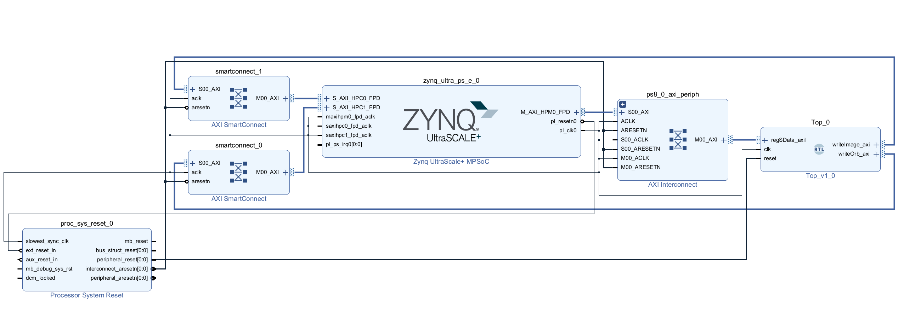
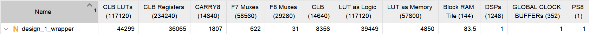

# DOSLAM: An High-Performance and Design Optimized SLAM Accelerator on FPGA

## 介绍
目前的orb slam加速器架构设计低效，性能较差。一些模块使用很少的资源但是使用了较低的并行度设计成为系统瓶颈，而另一些模块利用率极低。
模块使用了很多的资源但是却时常空闲利用率很低。当前orb slam加速器开源资料少，质量不高。

为了解决以上问题本项目基于FPGA平台，使用很少的资源实现了一个超高性能的orb slam加速器，加速器意在加速orb slam算法中最耗时的特征提取。

本项目使用 SpinalHDL 1.9.3，实现了特征提取和特征匹配中的算子，通过参数配置生成不同的加速器，满足不同的需求。
提供了一个每周期处理8个像素的超高并行度加速器。

提供了设备驱动，设备树文件和demo可在linux环境下直接使用。

## 描述

本工程实现如下提供一个axi lite接口配置，启动加速器。两个axi接口分别用于传递图片和描述子。


FPGA中的资源占用情况如图：


# 目录结构

- **`doslam/`**: 设备驱动，demo
    - **`DOSLAM`**: bit流和设备树问题存放位置
    - **`example2`**: 提供了一个demo，用于将img中的图像，进行特征提取处理
    - **`driver_DOSLAMDT`**: linux下doslam的设备驱动代码，用于在注册设备文件
    - **`build.sh`**: 加载bits，注册设备树，脚本文件
    - **`img`**: 提供了一个raw格式图片,用于测试
- **`src/`**: 源代码文件
    - **`main`**: SpinalHDL源代码文件
        - **`data`**: 数据文件
        - **`scala`**: SpinalHDL源代码文件
    - **`test`**: 仿真测试文件
        - **`ip`**: 用于仿真的ip文件
        - **`scala`**: 仿真代码
- **`verilog/`**: 源代码文件
    - **`tcl`**: 工程使用的tcl文件
        - **`generateIP.tcl`**: 用于生成代码中使用的ip核的脚本文件

# 运行

## 生成RTL代码

配置spinalHDL环境即可使用

## 运行仿真

运行仿真需要 vivado2021.2 并且配置环境变量
参考如下
https://github.com/SpinalHDL/SpinalHDL/pull/664

## 生成工程
本工程使用kr260板卡，vivado 2023.2版本。
./verilog/tcl/create_project.tcl
tcl脚本用于创建工程，修改如下变量的文件位置和目录。

- project_dir : 存放工程的位置
- src_file : 顶层代码路径
- ip_script :generateIP.tcl 路径
- design_block_script:design_1.tcl 路径

然后运行此脚本，自动创建工程。手动生成bit流。

## 运行demo

本demo运行4层图像金字塔，进行特征提取。

[安装ubuntu环境](https://www.amd.com/en/products/system-on-modules/kria/k26/kr260-robotics-starter-kit/getting-started/getting-started.html)

生成bin文件格式比特流，修改名称为DOSLAM.bit.bin,放置于./doslam/DOSLAM 目录下。
将整个doslam，复制到ubuntu下.
``` bash
cd doslam
./build.sh
cd example2
make
./main
```

./doslam/example2/main.c文件中存在两个宏定义
OURPUT_FIRE：将结果输入到文件中
REPORT：打印报告

生成的结果放置于./doslam/img文件夹下

