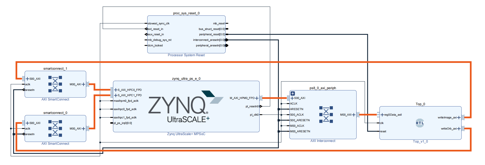
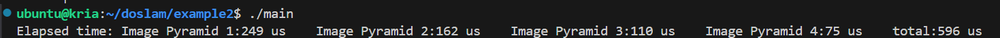
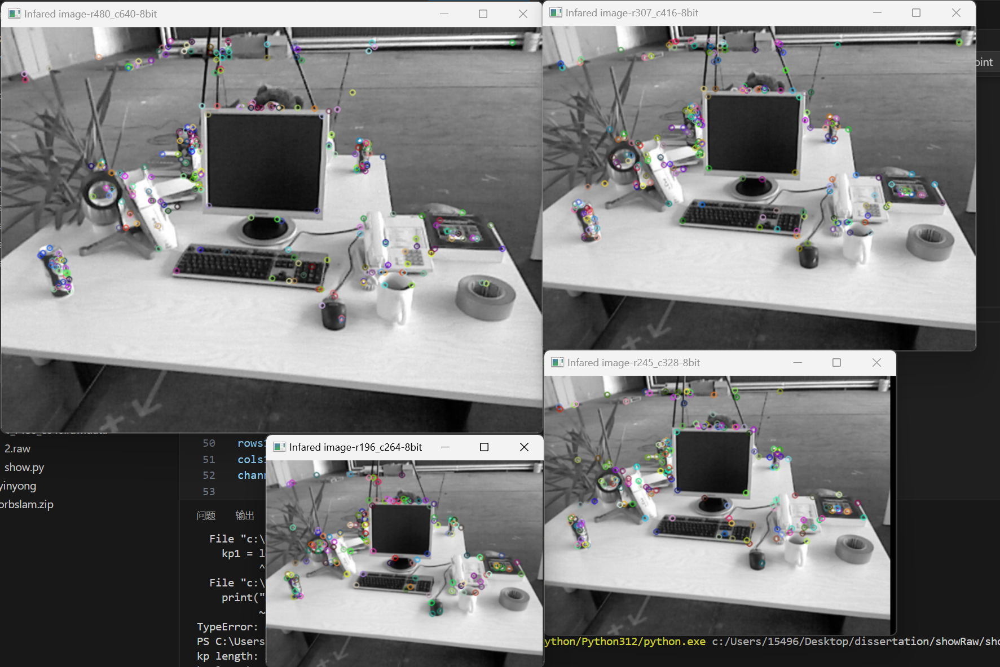

# DOSLAM: An High-Performance and Design Optimized SLAM Accelerator on FPGA

[Chinese document](link-to-chinese-document.md)

## Introduction
The current orb slam accelerator architecture is inefficiently designed and has poor performance. Some modules, which consume few resources and are the bottleneck of the system, are designed and implemented with low parallelism. And some other modules despite the use of a lot of resources but often idle utilization is very low .
The current orb slam acclerator has little open source information and is of low quality.
In order to solve the above problems this project is based on FPGA platform, based on this work the architecture is optimized so that the resource consumption and utilization of each module is more reasonable, using very few resources to achieve an ultra-high performance orb slam accelerator, the gas pedal is intended to accelerate the orb slam algorithm in the most time-consuming feature extraction.
- This project uses SpinalHDL 1.9.3, which implements feature extraction and feature matching, and generates gas pedals to meet different needs through parameter configuration.
- An ultra-high parallelism acelerator that processes 8 pixels per cycle is provided.
- Device drivers, device tree files and demos are provided for direct use in linux environment.

## Description
The block diagram of this project design is as follows, Top is our acelerator, our top layer provides an axi lite interface for configuration, to start the acelerator. Two axi interfaces are used to pass image and ORB feature point and descriptor information respectively.



The resource occupancy in the FPGA is shown in Fig:


The system architecture diagram is shown in Fig:


# directory structure

- **`doslam/`**: Device driver, demo
    - **`DOSLAM`**: Directory for storing bin format bitstream and device tree
    - **`example2`**: Provides a demo for feature extraction processing of images in img
    - **`driver_DOSLAMDT`**: Device driver code for DOSLAM on Linux, used for registering device files
    - **`build.sh`**: Script file for loading bits and registering device tree
    - **`img`**: Provides a raw format image, stores data files, and results will also be placed here
- **`src/`**: Source code files
    - **`main`**: SpinalHDL source code files
        - **`data`**: Data files
        - **`scala`**: SpinalHDL source code files
    - **`test`**: Simulation test files
        - **`ip`**: IP files used for simulation
        - **`scala`**: Simulation code
- **`verilog/`**: Source code files
    - **`tcl`**: Tcl files used in the project
        - **`generateIP.tcl`**: Script file for generating IP cores used in the code
        - **`design_1.tcl`**: Tcl file for generating bd used in the project
        - **`create_project.tcl`**: Tcl file for creating the project

# Run the demo

This project provides a demo that can be run directly on the FPGA board, four-layer image pyramid to detect feature points.

## Generate RTL Code

To generate the RTL code, you need to install Java, Scala, and SBT. Refer to the [official documentation](https://spinalhdl.github.io/SpinalDoc-RTD/en/SpinalHDL/Getting%20Started/Install%20and%20setup.html).

It is recommended to use IntelliJ IDEA, configure the Scala script, import the project from an external environment. Refer to the [official documentation](https://spinalhdl.github.io/SpinalDoc-RTD/en/SpinalHDL/Getting%20Started/IntelliJ.html).

Run [top.scala](./src/main/scala/top.scala) to generate the top-level RTL code.

Each file can be used to generate RTL code separately.

If you need to run images of larger sizes, modify MEM_DEPTH in TopConfig to represent the maximum depth of RAM and SIZE_WIDTH to represent the bit width of the image size.

The TopSort in TopConfig represents the maximum number of feature points that can be selected.

## Run Simulation

To run the simulation, you need Vivado 2021.2 and to [configure environment variables](https://github.com/SpinalHDL/SpinalHDL/pull/664).

## Generate Project
This project uses the kr260 board and Vivado 2023.2.

[create_project.tcl](./verilog/tcl/create_project.tcl) is used to create the project. Modify the file locations and directories of the following variables:

- project_dir: Location to store the project
- doslam_dir: Location of the current project

You can source this script in the Tcl console to create the project.

Synthesize and implement to generate the bitstream. Multiple strategies can be used to avoid negative timing.

Generate bin format bitstream.

## Run Demo

This demo runs a 4-layer image pyramid for feature extraction.

Install [Ubuntu 22.04](https://www.amd.com/en/products/system-on-modules/kria/k26/kr260-robotics-starter-kit/getting-started/getting-started.html).

Generate the bitstream file in bin format, rename it to DOSLAM.bit.bin, and place it in the ./doslam/DOSLAM directory.

Copy the entire doslam folder to the home directory on Ubuntu and run the following command.

``` bash
cd doslam
./build.sh
cd example2
make
./main
```

Four-layer image pyramid, 480*640 size image, the computation time is as follows (different thresholds result in different feature points extracted from the image, hence different times).



Enable two macro definitions in the [example2/main.c](./doslam/example2/main.c) file.

OURPUT_FIRE: Output the results to a file
REPORT: Print a report

The generated results are placed in the ./doslam/img folder and a report is printed.

Copy the files from the img folder and place them in the showDemo directory. Run [show.py](./doslam/showDemo/show.py) on the local machine.
The result is as shown below:



# TODO

- Improve block-based feature extraction to make feature extraction more uniform.
- Implement feature matching.
- Optimize the ORB SLAM algorithm at the software level to achieve real-time operation.
- Open-source reference models.

# Contact Me

Email: cqyinsist@qq.com