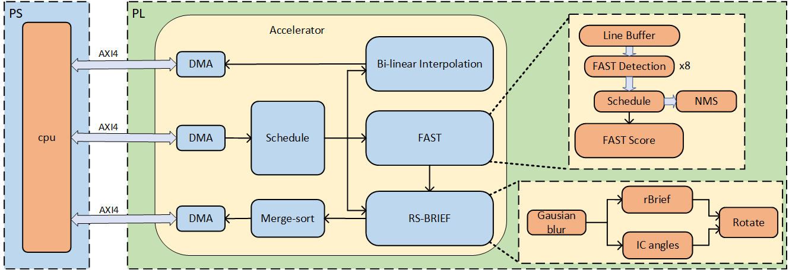

# DOSLAM: An High-Performance and Design Optimized SLAM Accelerator on FPGA

## 介绍
目前的orb slam加速器架构设计低效，性能较差。一些模块资源占用很少并且是系统瓶颈，在设计实现时却使用了较低的并行度设计。
而另一些模块尽管使用了很多的资源但是却时常空闲利用率很低。

当前orb slam加速器开源资料少，质量不高。

为了解决以上问题本项目基于FPGA平台，基于此这项工作对架构进行了优化让每个模块的资源占用和利用率更加合理，使用很少的资源实现了一个超高性能的orb slam加速器，加速器意在加速orb slam算法中最耗时的特征提取。

- 本项目使用 SpinalHDL 1.9.3，实现了特征提取和特征匹配，通过参数配置生成满足不同需求的加速器。

- 提供了一个每周期处理8个像素的超高并行度加速器。

- 提供了设备驱动，设备树文件和demo可在linux环境下直接使用。

## 描述

本工程设计框图如下，Top是我们的加速器，我们的顶层提供一个axi lite接口用于配置，启动加速器。两个axi接口分别用于传递图片和ORB特征点和描述符信息。


FPGA中的资源占用情况如图：


系统架构图如图所示：


# 目录结构

- **`doslam/`**: 设备驱动，demo
    - **`DOSLAM`**: bin格式bit流和设备树存放目录
    - **`example2`**: 提供了一个demo，用于将img中的图像，进行特征提取处理
    - **`driver_DOSLAMDT`**: linux下doslam的设备驱动代码，用于在注册设备文件
    - **`build.sh`**: 加载bits，注册设备树，脚本文件
    - **`img`**: 提供了一个raw格式图片,存放数据文件，结果也会放到这里
- **`src/`**: 源代码文件
    - **`main`**: SpinalHDL源代码文件
      - **`data`**: 数据文件
      - **`scala`**: SpinalHDL源代码文件
    - **`test`**: 仿真测试文件
      - **`ip`**: 用于仿真的ip文件
      - **`scala`**: 仿真代码
- **`verilog/`**: 源代码文件
    - **`tcl`**: 工程使用的tcl文件
      - **`generateIP.tcl`**: 用于生成代码中使用的ip核的脚本文件
      - **`design_1.tcl`**: 生成工程使用的bd的tcl文件
      - **`create_project.tcl`**: 创建工程的tcl文件

# 运行demo

本项目提供了一个demo可以直接在FPGA板卡上运行，四层图像金字塔检测特征点。

## 生成RTL代码

需要安装java，scala，sbt，参考[官方文档](https://spinalhdl.github.io/SpinalDoc-RTD/zh_CN/SpinalHDL/Getting%20Started/Install%20and%20setup.html)

推荐IntelliJ IDEA，配置scala脚本，从外部环境导入工程，参考[官方文档](https://spinalhdl.github.io/SpinalDoc-RTD/zh_CN/SpinalHDL/Getting%20Started/IntelliJ.html)

运行[top.scala](./src/main/scala/top.scala)生成顶层RTL代码。

每个文件都可以单独生成RTL代码。

如果您需要运行更大尺寸的图片请修改TopConfig的MEM_DEPTH代表RAM的最大深度和SIZE_WIDTH图片尺寸的位宽。

TopConfig的TopSort代表最大可以取前TopSort个特征点。

## 运行仿真

运行仿真需要 vivado2021.2 并且[配置环境变量](https://github.com/SpinalHDL/SpinalHDL/pull/664)

## 生成工程
本工程使用kr260板卡，vivado 2023.2。

[create_project.tcl](./verilog/tcl/create_project.tcl)用于创建工程，修改如下变量的文件位置和目录。

- project_dir : 存放工程的位置
- doslam_dir : 当前项目的位置

可以在tcl控制台下source此脚本，创建工程。

综合实现生成bit流，可以用多个策略进行实现避免时序为负。

生成bin格式bit流。

## 运行demo

本demo运行4层图像金字塔，进行特征提取。

安装[Ubuntu 22.04](https://www.amd.com/en/products/system-on-modules/kria/k26/kr260-robotics-starter-kit/getting-started/getting-started.html)

生成bin文件格式比特流，修改名称为DOSLAM.bit.bin,放置于./doslam/DOSLAM目录下。

将整个doslam文件夹，复制到ubuntu下家目录下，运行如下命令。

``` bash
cd doslam
./build.sh
cd example2
make
./main
```

四层图像金字塔，480*640尺寸图像，运算时间如下(不同阈值下，不同的图像提取到的特征点不同，因此时间不同)


开启[example2/main.c](./doslam/example2/main.c)文件中两个宏定义。

OURPUT_FIRE：将结果输入到文件中
REPORT：打印报告

生成的结果放置于./doslam/img文件夹下，并打印报告。

复制img中的文件，放置于showDemo目录下，在本机运行[show.py](./doslam/showDemo/show.py)
结果如下


# TODO

- 完善分块特征提取使特征提取更加均匀
- 加入实现特征匹配
- 从软件层面优化orb slam算法，达到实时运行
- 开源参考模型

# 联系我

邮箱:cqyinsist@qq.com
